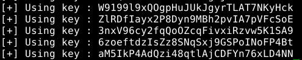

# Random Generator 

## Description

Le but est de déchiffrer le dossier compressé **data/oDjbNkIoLpaMo.bz2.crypt**.
Ce dossier compressé a été chiffré avec le code source **data/crypt.c**.

## Analyse

- Lorsqu'on étudie le fichier source data/crypt.c, on remarque que le chiffrement 
est un simple XOR. On peut donc en déduire que l'algorithme de déchiffrement 
est le même que celui du chiffrement.  

- On remarque également que l'utilisateur a généré sa clé de façon pseudo
aléatoire en utilisant la librairie standard *time.h*. De plus, il a initialisé
la seed avec le temps actuel : cela signifie que si on retrouve le moment 
où il a chiffré le fichier, on pourra le déchiffrer. 
Par ailleurs, on peut voir que la publication de ce fichier a été faite le 
19 décembre 2012. On peut donc en déduire que l'utilisateur a chiffré le fichier 
avant cette date. 

## Attaque

Nous allons donc faire une attaque par brute force. Pour cela, on va essayer
toutes les clés possibles utilisées pour chaque seconde du mois de décembre.

Pour chaque initialisation de la seed, on génère la clé associé. Puis, 
on déchiffre le fichier **data/oDjbNkIoLpaMo.bz2.crypt**. 
Ensuite, on regarde si le format du fichier déchiffré correspond au 
format **bzip2** : son nombre magique correspond à la suite "BZ" et est suivi 
du caractère "h". Si ce fichier est bien un bzip2, alors nous aurons trouvé 
le déchiffrement du fichier **data/oDjbNkIoLpaMo.bz2.crypt**.

## Morale

Il ne faut en aucun cas utiliser la librairie standard du langage C pour 
un générateur de nombres pseudo-aléatoires. En effet, si l'utilisateur 
génère sa clé avec cet aléatoire, cela peut être catastrophique sachant 
qu'on peut en déduire quand cette clé a été générée. 

L'exemple le plus parlant est l'utilisation du protocole PGP. Il consiste 
à envoyer des mails chiffrés. Pour cela, l'émetteur *A* et le destinataire 
*B* ont un couple de clés RSA : 
- A écrit son mail en clair
- A génère une clé symétrique *K* "pseudo-aléatoire" afin de chiffrer son mail
- A chiffre la clé *K* avec la clé publique de B
- A envoie la clé *K* chiffrée avec son mail chiffré

Si le PRNG n'est pas sûr et utilise notamment *time.h*, un attaquant peut 
facilement déchiffré *K* (sans s'attaquer à RSA) puisque cette clé a été 
générée juste avant d'envoyer le mail. 
